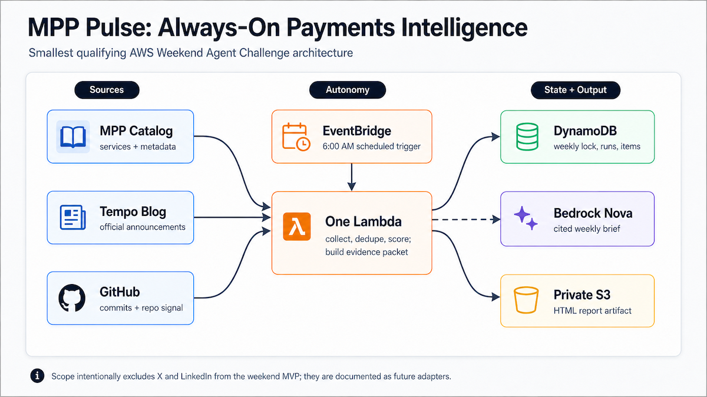
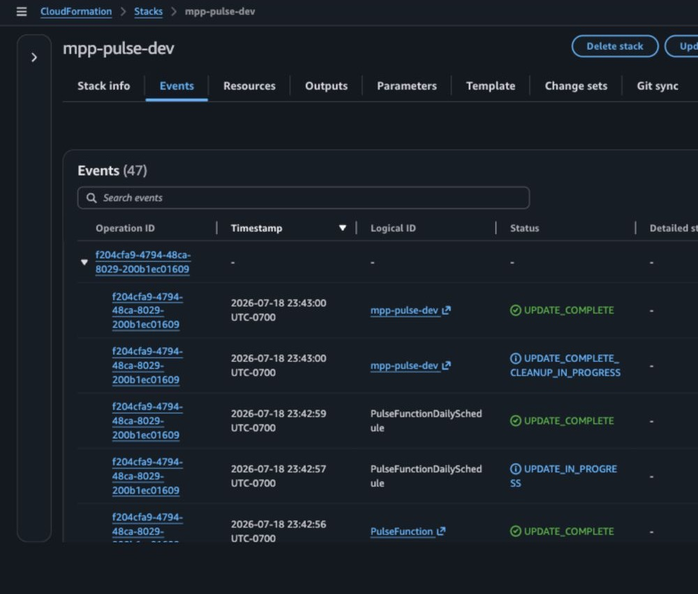
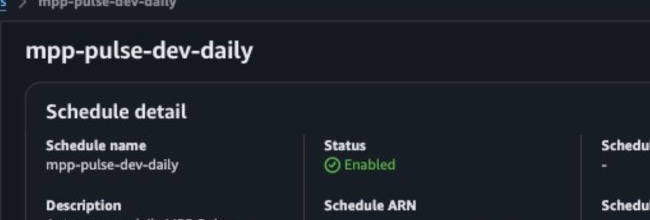
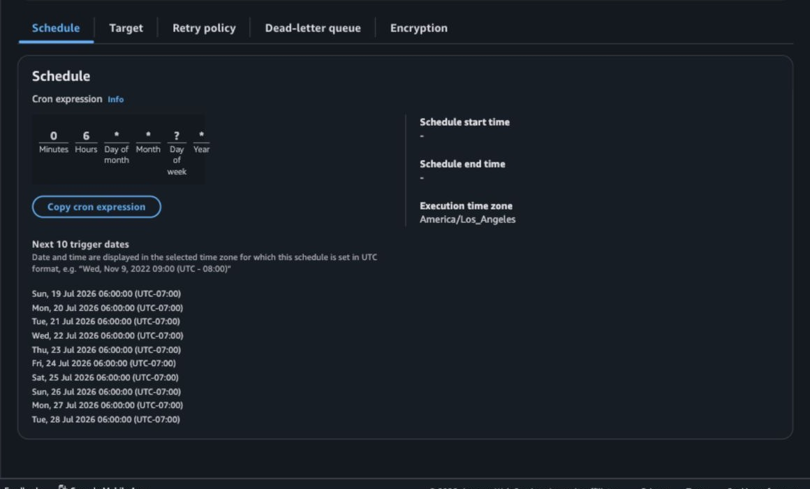
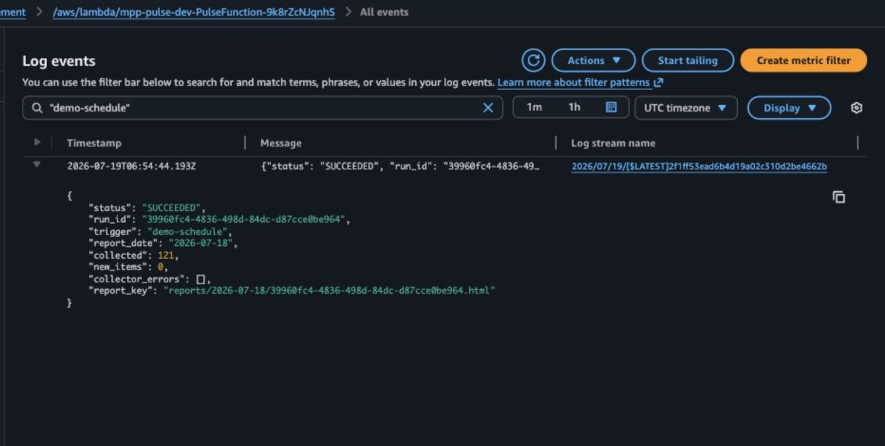
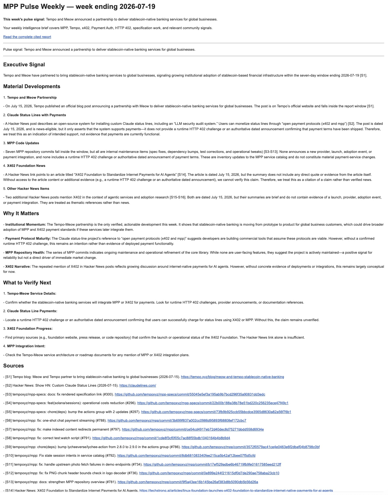

# MPP Pulse

[](https://github.com/schwentker/mpp-pulse/actions/workflows/ci.yml)
[](template.yaml)
[](src/app.py)
[](LICENSE)

MPP Pulse is an always-on AWS intelligence agent for the Machine Payments
Protocol (MPP) and Tempo ecosystem. It wakes up every Sunday, searches the
preceding seven days, asks Amazon Nova to prepare a cited briefing, emails it,
and saves a private HTML report for review.

MPP Pulse is the open-source engine behind a weekly machine-payments
intelligence brief. To receive the report, subscriptions are opening soon.

The project was built for the AWS Builder Center Weekend Agent Challenge with a
deliberately small architecture: one schedule, one Lambda, DynamoDB, S3, and
Amazon Bedrock.

## What it does

Every Sunday at 11:30 AM Pacific, MPP Pulse:

1. Fetches the public MPP services catalog.
2. Checks the official Tempo blog index.
3. Retrieves recent commits from the MPP and PaymentAuth specification repositories.
4. Searches Hacker News, Reddit, and optionally X for relevant seven-day signals.
5. Normalizes URLs and creates stable content identities.
6. Uses conditional DynamoDB writes to suppress duplicate evidence storage.
7. Applies deterministic importance scoring and ranks up to 50 report items.
8. Sends the ranked weekly evidence packet to Amazon Nova 2 Lite.
9. Produces and emails a cited report with an exact source ledger.
10. Saves the finished report as private, encrypted HTML in Amazon S3.
11. Writes structured run results to CloudWatch and DynamoDB.

Collectors fail independently. If one source is unavailable, the remaining
sources can still produce a `PARTIAL_SUCCESS` report. If Bedrock is unavailable,
the function produces a deterministic source-linked fallback report.

## Verified deployment

The reference deployment has been tested in `us-west-2`.

| Check | Result |
|---|---|
| CloudFormation stack | `UPDATE_COMPLETE` |
| Weekly schedule | Enabled |
| Schedule | `cron(30 11 ? * SUN *)` |
| Timezone | `America/Los_Angeles` |
| Model | `us.amazon.nova-2-lite-v1:0` |
| Autonomous evidence run | `SUCCEEDED` |
| Evidence collected | 121 records |
| Duplicate inserts on repeat run | 0 |
| Collector errors | 0 |
| Unit tests | 11 passing |
| SAM validation and build | Passing |

The production weekly schedule remains enabled.

## Architecture



AWS resources are defined in [template.yaml](template.yaml):

- One ARM64 AWS Lambda function
- One EventBridge Scheduler schedule
- One DynamoDB on-demand table
- One private encrypted S3 bucket
- One CloudWatch Lambda error alarm
- Least-purpose IAM policies generated through AWS SAM

## Why primary sources only

The weekend build intentionally watches three high-signal surfaces:

- `https://mpp.dev/api/services`
- `https://tempo.xyz/blog`
- `https://github.com/tempoxyz/mpp`
- `https://github.com/tempoxyz/mpp-specs` (the source for `paymentauth.org`)

Hacker News and Reddit are optional community collectors in the deployed path,
with a strict seven-day window and relevance filtering. X/Twitter is supported
only when an official API bearer token is configured as `X_BEARER_TOKEN`.
LinkedIn and broad web search remain future adapters.

The protocol watchlist includes `mpp.dev`, “Machine Payments Protocol,” `x402`,
`x.402`, `paymentauth.org`, “HTTP 402,” `draft-httpauth-payment-00`, and
`draft-ryan-httpauth-payment`. Named-author signals are also tracked for Brendan
Ryan, Jake Moxey, and Tom Meagher with Tempo context, plus Jeff Weinstein and
Steve Kaliski with Stripe context. On X, the known accounts
`@jeff_weinstein` and `@stevekaliski` are included directly.

## Methodology

Evidence enters a report only with direct support: matching terms in the title,
URL, text, repository, or recognized author context. Primary sources outrank
community discussion. Catalog inventory is not treated as news. Proposals are
distinguished from shipped changes. Scoring weighs source authority, recency,
protocol significance, implementation activity, adoption signals, and payment
relevance; exact weights and tuned rules evolve privately.

## Evidence and AI safety

The language model does not discover facts. Collection, normalization,
deduplication, and ranking happen before Bedrock is called.

Nova receives a bounded JSON packet containing:

- Stable source labels such as `[S1]`
- Titles and canonical URLs
- Source type and deterministic score
- A bounded source summary

The prompt requires the model to:

- Use only supplied evidence
- Cite factual claims with `[S#]`
- Label inference explicitly
- Avoid treating a commit or proposal as a shipped feature
- Keep the report below 1,000 words

The application appends its own deterministic source ledger after model
generation. This guarantees that cited evidence retains exact URLs even if the
model formats its own source section imperfectly.

## Persistence and idempotency

DynamoDB uses a single string partition key:

| Record | Key pattern | Purpose |
|---|---|---|
| Weekly lock | `LOCK#WEEK#YYYY-MM-DD` | Prevent repeated weekly processing |
| Evidence | `ITEM#SHA256` | Store a stable version of observed content |
| Run | `RUN#UUID` | Record status, counts, errors, and report location |

Evidence identity excludes collection time. An unchanged service, blog entry,
or commit therefore receives the same content ID on later runs. Conditional
writes using `attribute_not_exists(pk)` prevent duplicate inserts.

Manual demonstration events can set:

```json
{
  "force": true,
  "window_days": 7
}
```

`force` bypasses the weekly lock. `window_days` controls the reporting window;
the production schedule and manual example both use seven days.

S3 reports use:

```text
reports/YYYY-MM-DD/RUN_ID.html
```

Objects are private, encrypted with SSE-S3, and expire after 30 days.

## Repository structure

```text
mpp-pulse/
├── .github/workflows/ci.yml
├── docs/
│   ├── architecture.mmd
│   ├── article.md
│   ├── evidence-checklist.md
│   └── screenshots/
│       ├── 01-stack-complete.png
│       ├── 02-eventbridge-schedule.png
│       ├── 02a-eventbridge-enabled.png
│       ├── 03-html-report.png
│       └── 04-autonomous-invocation.png
├── events/manual.json
├── src/
│   ├── app.py
│   └── requirements.txt
├── tests/test_app.py
├── LICENSE
├── pytest.ini
├── README.md
└── template.yaml
```

## Prerequisites

- An AWS account
- AWS credentials allowed to deploy CloudFormation/SAM resources
- AWS CLI
- AWS SAM CLI
- Amazon Bedrock access in the deployment region
- Python 3.11 for tests and the Lambda build

The default region and model used by the reference deployment are:

```text
Region: us-west-2
Model:  us.amazon.nova-2-lite-v1:0
```

Confirm the model profile is available:

```bash
aws bedrock list-inference-profiles \
  --region us-west-2 \
  --type-equals SYSTEM_DEFINED \
  --query 'inferenceProfileSummaries[?contains(inferenceProfileId, `nova-2-lite`)]'
```

## Local validation

No third-party runtime packages are required. AWS Lambda supplies `boto3` and
`botocore`.

```bash
python3 -m pytest -q
sam validate --lint
sam build
```

Expected result:

```text
11 passed
Build Succeeded
template.yaml is a valid SAM Template
```

## Deploy safely

The template defaults the schedule to `DISABLED`. Deploy and verify manually
before allowing autonomous runs.

```bash
sam build

sam deploy \
  --stack-name mpp-pulse-dev \
  --region us-west-2 \
  --capabilities CAPABILITY_IAM \
  --resolve-s3 \
  --parameter-overrides \
      ScheduleState=DISABLED \
      BedrockModelId=us.amazon.nova-2-lite-v1:0 \
      ScheduleTimezone=America/Los_Angeles \
      GitHubRepository=tempoxyz/mpp
```

Read the generated resource names:

```bash
aws cloudformation describe-stacks \
  --stack-name mpp-pulse-dev \
  --region us-west-2 \
  --query 'Stacks[0].Outputs' \
  --output table
```

## Verify manually

Replace `FUNCTION_NAME` with the CloudFormation output:

```bash
aws lambda invoke \
  --function-name FUNCTION_NAME \
  --region us-west-2 \
  --payload file://events/manual.json \
  response.json
```

Confirm that the response contains:

```json
{
  "status": "SUCCEEDED",
  "collector_errors": [],
  "report_key": "reports/YYYY-MM-DD/RUN_ID.html"
}
```

Then verify:

1. CloudWatch contains the structured completion line.
2. DynamoDB contains a `RUN#...` record and evidence items.
3. S3 contains the reported HTML object.
4. A second forced run reports zero newly inserted unchanged items.

## Enable the weekly schedule

```bash
sam deploy \
  --stack-name mpp-pulse-dev \
  --region us-west-2 \
  --capabilities CAPABILITY_IAM \
  --resolve-s3 \
  --no-confirm-changeset \
  --parameter-overrides \
      ScheduleState=ENABLED \
      BedrockModelId=us.amazon.nova-2-lite-v1:0 \
      ScheduleTimezone=America/Los_Angeles \
      GitHubRepository=tempoxyz/mpp
```

Verify the result:

```bash
aws scheduler get-schedule \
  --name mpp-pulse-dev-weekly \
  --region us-west-2 \
  --query '{State:State,Expression:ScheduleExpression,Timezone:ScheduleExpressionTimezone}'
```

## Configuration

CloudFormation parameters:

| Parameter | Default | Description |
|---|---|---|
| `ScheduleState` | `DISABLED` | Safe initial schedule state |
| `ScheduleTimezone` | `America/Los_Angeles` | EventBridge evaluation timezone |
| `BedrockModelId` | `us.amazon.nova-2-lite-v1:0` | Bedrock inference profile |
| `GitHubRepository` | `tempoxyz/mpp` | Repository watched for recent commits |

Lambda environment variables are populated from these parameters and generated
resource references.

## Test plan

1. Unit-test URL canonicalization, scoring, timestamp handling, content IDs,
   fallback citations, and HTML rendering.
2. Validate and build the SAM template.
3. Deploy with the schedule disabled.
4. Invoke with the supplied manual event.
5. Confirm run and evidence records in DynamoDB.
6. Confirm a rendered HTML object in S3.
7. Review CloudWatch for collector or Bedrock errors.
8. Repeat the run and confirm duplicate evidence is not inserted again.
9. Enable the production schedule.
10. Capture a genuine EventBridge-triggered invocation.

## Cost and failure controls

- One scheduled invocation per week
- Reserved Lambda concurrency of one
- 90-second Lambda timeout
- Six bounded source collectors
- At most 100 MPP catalog records
- At most 20 Tempo links
- At most 100 recent commits from each watched GitHub repository
- Up to 50 ranked evidence records sent to Bedrock
- Bedrock output capped at 2,400 tokens
- DynamoDB on-demand billing
- Private encrypted S3 storage
- 30-day S3 lifecycle expiration
- Deterministic report fallback if Bedrock fails
- Independent collector failure handling
- Disabled schedule on first deployment

## Rollback

Disable the schedule first:

```bash
sam deploy \
  --stack-name mpp-pulse-dev \
  --region us-west-2 \
  --capabilities CAPABILITY_IAM \
  --resolve-s3 \
  --no-confirm-changeset \
  --parameter-overrides ScheduleState=DISABLED
```

Export any reports you want to keep, empty the generated report bucket, and
delete the stack:

```bash
aws s3 rm s3://BUCKET_NAME --recursive
sam delete --stack-name mpp-pulse-dev --region us-west-2
```

This removes the Lambda, schedule, DynamoDB table, S3 bucket, IAM roles, and
alarm created by the application stack.

## Deployment evidence

CloudFormation deployment:



Enabled weekly schedule:





Autonomous invocation:



Generated report:



The complete evidence checklist is in
[docs/evidence-checklist.md](docs/evidence-checklist.md).

## Roadmap

- Detect material field-level changes in MPP catalog records
- Add GitHub release, pull request, and specification-change monitoring across
  MPP, PaymentAuth, HTTP 402, and x402
- Distinguish proposals, announcements, implementations, and verified deployments
- Improve evidence provenance, corroboration, and confidence classification
- Cluster related evidence across primary and community sources
- Surface longitudinal changes across providers, payment rails, and protocol
  adoption
- Explore MPP-native distribution experiments for selected research

## License

[MIT](LICENSE)
