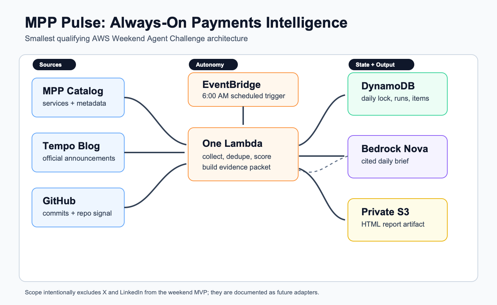
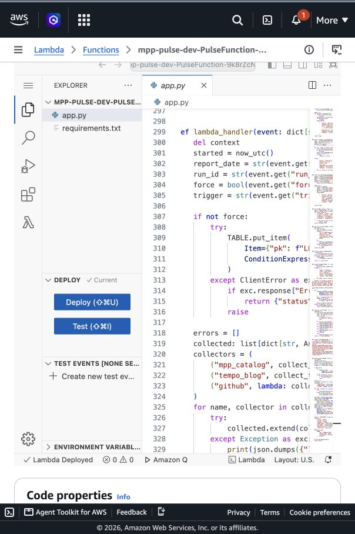
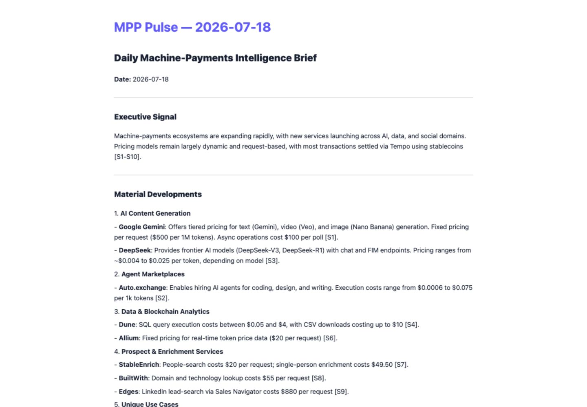

# Weekend Agent Challenge: MPP Pulse, an Always-On Payments Intelligence Agent

Tag: #agents

Machine payments are becoming one of the most interesting parts of the agent economy. Software agents, APIs, and services need ways to pay each other programmatically—often in small amounts and without stopping for a human checkout flow. The Machine Payments Protocol (MPP), x402, HTTP payment authentication work, and the Tempo ecosystem are signals of that shift. The challenge is that useful evidence is scattered across protocol sites, company blogs, GitHub repositories, and technical communities.

That scatteredness is the problem I built for. I wanted a focused agent that would monitor the emerging payments layer while I was away, distinguish genuine developments from loosely related technology news, and deliver a briefing that both humans and software agents could use. It is not a button-driven chatbot or a generic news digest. It is an always-on research assistant for a narrow, fast-moving technical domain.

The result is **MPP Pulse**, a serverless AWS agent that runs every Sunday and emails a cited, seven-day machine-payments intelligence report.

## Vision and What the Agent Does

MPP Pulse answers one practical question:

> What changed across machine payments during the last seven days, and why might it matter?

Amazon EventBridge Scheduler triggers the agent every Sunday at 11:30 AM in the `America/Los_Angeles` timezone. Once triggered, it works without human input: collecting evidence, rejecting irrelevant items, ranking developments, generating an analytical brief, saving an HTML copy, and emailing the result.

The search criteria cover MPP, the Machine Payments Protocol, Tempo, x402 and x.402, PaymentAuth.org, HTTP 402, and relevant Internet-Draft names such as `draft-httpauth-payment-00`. The agent also watches activity associated with people working directly in this area, including Brendan Ryan, Jake Moxey, Tom Meagher, Jeff Weinstein, and Steve Kaliski.

The source strategy is deliberately selective:

- The MPP services catalog is treated as ecosystem inventory, not automatically as breaking news.
- Tempo posts are included only when their publication date falls inside the report window.
- GitHub activity comes from relevant repositories, including `tempoxyz/mpp` and `tempoxyz/mpp-specs`.
- Hacker News and Reddit are searched for explicit machine-payment terms, with strict relevance checks.
- X is an optional adapter that uses the official API when a bearer token is configured.

That distinction matters. A service appearing in a catalog does not prove that it is a newly launched MPP provider. Likewise, a popular Hacker News post is not relevant merely because it mentions agents or APIs. MPP Pulse now requires direct evidence—matching terms in the title, URL, text, repository, or recognized author context—before community content enters the report.

Each accepted item is normalized into a common evidence format with a title, URL, source, timestamp, content fingerprint, and supporting text. The Lambda deduplicates items and applies a deterministic score based on source authority, recency, protocol significance, implementation activity, adoption signals, and payment relevance.

The top evidence is then sent to Amazon Bedrock using an Amazon Nova model. The prompt requires the model to use only the supplied sources, cite factual claims, distinguish shipped changes from proposals, and separate evidence from interpretation. The resulting weekly brief includes a concise pulse signal, ranked developments, why they matter, unresolved questions, and a source ledger.

The HTML report is saved privately in Amazon S3 and the report is delivered through Amazon Simple Email Service (SES). The subject identifies the week and the topics covered, so the result feels like a useful intelligence product rather than an infrastructure notification.

## How I Built It

My main development decision was to keep the architecture small enough to complete and verify during the challenge. I used AWS SAM, one Python Lambda function, one DynamoDB table, one private S3 bucket, EventBridge Scheduler, Amazon Bedrock, SES, and CloudWatch. The goal was not to build a complete market-intelligence platform. It was to build the smallest autonomous loop that was useful, inspectable, and inexpensive to continue running.

The Lambda uses lightweight HTTP collection and keeps the workflow in one deployable function. Internally, the code separates collection, normalization, relevance filtering, scoring, persistence, summarization, rendering, and delivery. Collectors fail independently, so a Reddit rate limit or temporary blog error produces a partial-success run instead of destroying the whole report.

Idempotency was an important detail. Schedulers can retry, and manual demonstrations can accidentally run more than once. The Lambda therefore writes a weekly lock to DynamoDB using a conditional expression. Evidence records use stable identities and content fingerprints, preventing the same unchanged item from being inserted repeatedly.

I also built a deterministic fallback report. If Bedrock is temporarily unavailable, MPP Pulse can still produce ranked evidence with source links. The model adds synthesis, but it is not responsible for discovering or inventing the underlying facts.

The hardest challenge was source quality. An early report treated existing MPP catalog entries as if they were new developments. Another broad community query returned unrelated Hacker News projects. Both results looked polished but failed the usefulness test. I corrected this by separating inventory from news, enforcing the seven-day publication window, narrowing community queries, adding explicit relevance gates, and making unsupported items ineligible for the final evidence packet.

This was the most valuable iteration of the build: an intelligence agent is only as good as what it refuses to include.

## AWS Services Used and Architecture Overview

The architecture is compact:

- **Amazon EventBridge Scheduler** invokes the agent every Sunday at 11:30 AM Pacific.
- **AWS Lambda** collects, filters, scores, summarizes, renders, and sends the report.
- **Amazon DynamoDB** stores weekly locks, run state, and deduplicated evidence.
- **Amazon Bedrock with Amazon Nova** produces the cited weekly synthesis.
- **Amazon S3** stores a private HTML report for inspection and evidence.
- **Amazon SES** emails the completed report.
- **Amazon CloudWatch** captures logs, invocation evidence, and errors.
- **AWS SAM** defines the infrastructure as code and deploys the stack.

The autonomous flow is:

1. EventBridge Scheduler invokes Lambda with a seven-day window.
2. Lambda acquires the DynamoDB weekly lock.
3. Collectors inspect MPP, Tempo, GitHub, Hacker News, and optional Reddit or X sources.
4. Relevance filters reject unrelated or undated results.
5. Accepted evidence is deduplicated, scored, and persisted.
6. Bedrock/Nova creates a cited weekly pulse from the highest-ranked evidence.
7. Lambda writes the HTML report to S3.
8. SES sends the report by email.
9. CloudWatch preserves proof that the autonomous invocation completed.

For cost control, DynamoDB uses on-demand billing, Lambda reserved concurrency is one, model input and output are bounded, and old S3 artifacts expire automatically. Running weekly instead of daily further reduces API calls and model usage. The schedule can be disabled independently, and the complete stack can be removed with AWS SAM if I no longer need it.

## What I Learned

The biggest lesson was that autonomy is most convincing when the operational details are solid. The generated prose is visible, but reliability comes from the schedule, idempotency lock, source isolation, stable identifiers, private storage, email delivery, and CloudWatch logs. Those parts turn a demo script into a worker that can be trusted to run unattended.

I also learned that relevance is a product feature. Broad search creates the appearance of coverage while forcing the reader to do the filtering. A narrow, evidence-first report is more valuable. Primary sources deserve more weight, community sources need explicit keyword and context checks, and a service directory must not be confused with a news feed.

Finally, the project reinforced a useful agent pattern: deterministic code should collect, validate, rank, and preserve evidence; the language model should synthesize that bounded packet. Nova is the analyst, not the database.

The current version is useful to protocol builders, payment teams, investors, researchers, and anyone tracking agent commerce. It is also structured so that another agent could consume the same evidence later. Future adapters could add more official company feeds, richer X monitoring, claim-level change detection, and a paid API for the latest brief. Eventually, it would be fitting to expose MPP Pulse through MPP itself: a machine-payments intelligence product that other agents can pay to access.

## Link to App or Repo

Public GitHub repository:

https://github.com/schwentker/mpp-pulse

The repository includes the AWS SAM template, Lambda source, tests, deployment and rollback instructions, cost controls, screenshots, architecture materials, and this article draft.
